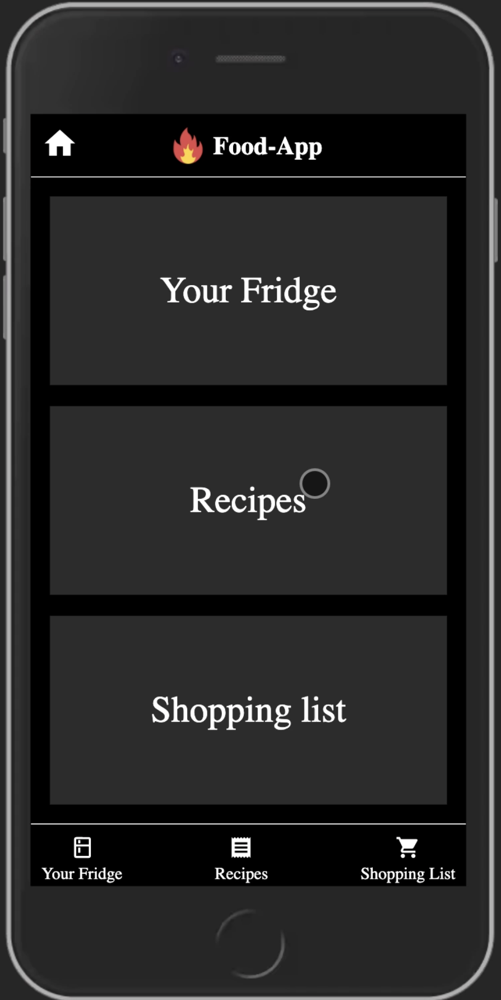

# Fridge-Shopping-Recipe App

This app was built during the `</salt>` Hackday.  
In this app, you can store your food in the section 'your fridge'.  
Then you can search for the best matching recipe results depending on the food, you have at home.  
Missing ingredients can be added to the shopping list.  
After shopping, the new food gets added to the fridge.  
From there you can search for new recipes with your new updated fridge.  
You can also save recipes for later.

## Installation

Install all dependencies (3x package.json):

1. in root folder
2. cd backend/
3. cd frontend/

```bash
npm install
```

## Usage

You can run npm run dev in root folder to start both, backend on localhost:8080 and frontend on localhost:3000

```bash
npm run dev
```

## Tests

There are some tests set up on backend and frontend

backend: mocka + chai  
frontend: jest / react testing library

```bash
npm test
```

## Info Design

Mainly for mobile view, desktop version not optimized yet

## Preview

| [](https://user-images.githubusercontent.com/70095024/111065084-21bfd100-84b8-11eb-8494-0c80cbff434e.mp4 "Click to watch the demo") |
| :----------------------------------------------------------------------------------------------------------------------------------------------------------------: |
|                                                                         Preview of the app                                                                         |
